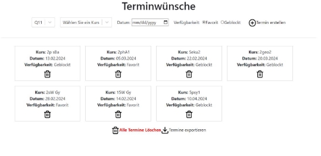

**Softwarepraktikum WiSe 23/24**

**Gruppe 12**

Schulaufgabenplaner Benutzerhandbuch

Betreuer: Leon Liman

Chirstian Wagner, Nam Pham, Katja Dietze, Paul Igna

6\. Februar 2024

Inhaltsverzeichnis

[1 Benutzeroberfläche Schulaufgabenplaner](#_page1_x56.69_y56.69) 2

1. [Struktur der Excel-Listen beim hochladen von Kursliste und Schülerliste . . . .](#_page2_x56.69_y602.93) . . . . . . 3
1. [Die Kursliste ](#_page3_x56.69_y56.69). . . . . . . . . . . . . . . . . . . . . . . . . . . . . . . . . . . . . . . . 4
1. [Die Kalenderliste .](#_page3_x56.69_y267.79) . . . . . . . . . . . . . . . . . . . . . . . . . . . . . . . . . . . . . 4
2. [Hochladen einer Excel-Datei . .](#_page3_x56.69_y602.63) . . . . . . . . . . . . . . . . . . . . . . . . . . . . . . . . . . 4
3. [Syntaxprüfer .](#_page4_x56.69_y378.38) . . . . . . . . . . . . . . . . . . . . . . . . . . . . . . . . . . . . . . . . . . . . 5

   [1.3.1 Kopfzeilen der Dateien . ](#_page5_x56.69_y484.85). . . . . . . . . . . . . . . . . . . . . . . . . . . . . . . . . . 6

4. [Konfigurieren des Algorithmus . .](#_page6_x56.69_y56.69) . . . . . . . . . . . . . . . . . . . . . . . . . . . . . . . . 7
5. [Der Kalender ](#_page6_x56.69_y552.68). . . . . . . . . . . . . . . . . . . . . . . . . . . . . . . . . . . . . . . . . . . . 7

[2 Benutzeroberfläche Termin Tool](#_page9_x56.69_y472.45) 10

1

1 Benutzeroberfläche Schulaufgabenplaner

Die Benutzeroberflächedes Schulaufgabenplaners, die in Abbildung 1 dar[gestellt](#_page1_x484.76_y539.05) ist, besteht aus folgen- den Elementen:

- **Zwei Upload-Buttons:** Diese dienen zum Hochladen der Kursliste und der Kalenderliste.
- **Ein Konfigurations-Button:** Mit diesem Button kann der Benutzer den Algorithmus konfigurieren.
- **Vier aufeinanderfolgende Buttons:** Diese dienen dazu, den Algorithmus zu initialisieren, zu starten, einzeln zu iterieren und zu stoppen.
- **Der Kalender:** Hier werden alle Schulaufgaben sowie Ferien und Feiertage angezeigt.
- **Eine Erläuterungsfunktion:** Diese bietet dem Benutzer bei der ersten Verwendung eine kurze Erklärung.
- **Zwei Download-Buttons:** Mit diesen kann der Benutzer die fertig sortierten Schulaufgaben als Excel-Datei herunterladen.

Abbildung 1: Benutzeroberflächebeim Start der Anwendung

Erläuterung anzeigen: Diese Funktion startet eine Tour durch das Fenster, bei der dem Benutzer zu jeder einzelnen Komponente eine Erklärung in der Benutzeroberflächeangezeigt wird. Während dieser Tour werden die einzelnen Komponenten hervorgehoben und ein Dialogfenster erscheint. Der Benutzer kann sich durch die Tour klicken, einzelne Schritte überspringen oder sich mit den Pfeiltasten durch die Tour navigieren. Während der Tour kann der Benutzer bereits mit den Buttons interagieren, allerdings ist das Scrollen im Fenster deaktiviert. Sollte der Benutzer wieder scrollen wollen, muss er die Tour beenden.

Abbildung 2: Reactour wenn man auf Erläuterung drückt

- **Schülerliste-Hochladen:** Die Datei, die die Kursliste und Kalenderliste enthält und hochgeladen werden muss, sollte eine Excel-Datei im entsprechenden Format sein. Nach erfolgreichem Hochla- den wird der Button grün und zeigt die Anzahl der erfolgreich eingelesenen Kurse und Schüler an.
- **Kalender-Hochladen:** BeimHochladendesKalenderswirddieAnzahldereingelesenenEreignisse sowie der Zeitraum, in dem die Schulaufgaben stattfinden,angezeigt.
1. Struktur der Excel-Listen beim hochladen von Kursliste und Schülerliste

Für das erstellen der Excel-Listen gibt es zwei verschiedene Strukturen. Eine Struktur für die **Kursliste** und eine weitere für die **Kalenderliste**. Diese sehen wie folgt aus:

Abbildung 3: Links: Beispiel für die Kursliste, Rechts: Beispiel für die Kalenderliste

1. Die Kursliste

Eine Zeile in der Kursliste soll einen Kurs darstellen, wobei dieser **einen Namen** hat, **einen Lehrer**, der den Kurs unterrichtet, **ein Fach** und anschließend **eine Schiene** dem dieser Kurs zugewiesen. Daraufhin folgt **die Schülerliste** welche alle Schüler enthält, die an diesem Kurs teilnehmen.

- **Der Kurs** wird in Spalte A angebenen, wobei die Kopzeile in der ersten Zeile ist. Bei dem Kurs ist wichtig zu beachten, dass jeder Kurs in der Spalte nur **einmal** vorkommen darf.
- **Der Lehrer, das Fach und die Schiene** werden jeweils in Spalte B, C und D angeben. Auch hier beginnt die Kopfzeile in der ersten Zeile. Hier kann es durch aus vorkommen, dass einer dieser Punkte mehrmals vorkommen. Zum Beispiel kann ein Lehrer mehrere Kurse unterrichten, mehrere Kurse können einer Schiene zugewiesen werden und es können auch mehrere Kurse ein Fach teilen.
- **Die Schülerliste** beginnt ab der Spalte E. Im Vergleich zu den ersten vier Spalten, kann die Schülerliste mehr als nur ein Objekt beinhalten. Die Schüler des Kurses werden ab der Spalte E, in der zugehörigen Zeile der Kurses, Reihe nach aufgezählt, wobei jede Zelle nur einen Schüler beinhalten darf.
2. Die Kalenderliste

Im Vergleich zur Kursliste, hat die Kalenderliste zwei Kopfzeilen. Eine Kopfzeile für das Einlesen der Zeitspanne des Schulhalbjahres und eine weitere für das Einlesen der Veranstaltungen, also die Ferien und Feiertage.

**Kopfzeile 1** (Zeile 1):

Spalte A ⇒ Schulhalbjahr (Zeitspanne) Spalte B ⇒ Halbjahr - Beginn

Spalte C ⇒ Halbjahr - Ende

Unter der Spalte **Schulhalbjahr (Zeitspanne)** wird nichts angegeben. Die Zeile bleibt leer. Diese soll nur veranschaulichen, dass daraufhin das kommende Schulhalbjahr angeben werden soll. Genau das geschieht unter der Spalte **Halbjahr - Beginn** und **Halbjahr - Ende**. Die gegebene Zeitspanne wird dann beim Schulaufgabenplaner berücksichtigt. Prüfungen und sonstige Veranstaltungen werden nur innerhalb dieser Zeitspanne geplant.

**Kopfzeile 2** (Zeile 4):

Spalte A ⇒ Name der Veranstaltung Spalte B ⇒ Beginn

Spalte C ⇒ Ende

In diesen Spalten befindensich zeilenweise die Veranstaltungen. Beginnend mit der Spalte **Name der Veranstaltung** welches begleitet wird mit dem **Beginn** - Tag und dem **Ende** - Tag der Veranstaltung. Hat die Veranstaltung nur einen Beginn-Tag ohne Ende-Tag (also keine Angabe in dieser Zelle), so wird

dieser Veranstaltung als ein **Feiertag** handgehabt. Wird ein Beginn-Tag und ein Ende-Tag mit angegeben,

so handelt es sich um **Ferien**. Alles andere ist eine ungültige Eingabe.

2. Hochladen einer Excel-Datei

Der erste Schritt für den Schulaufgabenplaner wird es sein, die Kursliste, als auch die Kalenderliste hochzuladen. Dafür haben Sie jeweils zwei Buttons zur Verfügung. Diese haben die Bezeichnungen **KURSE HOCHLADEN** und **KALENDER HOCHLADEN**.

Abbildung 4: Kursliste und Kalenderliste beim Uploaden

Beim Hochladen können zwei Ereignisse eintreten:

1. Die Datei wurde erfolgreich hochgeladen. Die Upload-Buttons leuchten grün auf und Ihnen werden zusätzlich Information bezüglich der jeweiligen Liste angegeben, siehe Abbildung 4.
- Kursliste: Hier werden die Anzahl der Schüler und Kurse angegeben, die erfolgreich hochge- laden wurden.
- Kalenderliste: Hier werden die Anzahl der Events angegeben, die erfolgreich hochgeladen wurden, als auch die Zeitspanne des Schulhalbjahres.

Ist dies geschen, dann können Sie mit der Prozedur weitermachen.

2. Die Datei enthält einen Fehler und das Hochladen der Liste wird abgebrochen. Die Gründe dafür können divers sein. Gefunden wird der Fehler beim Einlesen der gewählten Excel-Datei vom Syntaxüberprüfer. Wird das Hochladen abgebrochen, so wird Ihnen eine Meldung angezeigt, siehe Abbildungen 5[ und](#_page4_x484.76_y761.91) 6

Diese kann folgende Arten von Wanrmeldungen sein:

- Warnmeldung: Der Syntaxüberprüfer hat was verdächtiges wahrgenommen, was jedoch nicht zwingend zu einem Problem führt: Das Programm wird weiterhin ausgeführt. Eine Beschreibung für den Grund der Warnung wird mitgegeben, als auch eine Zeilenangabe (sofern diese auch nötig ist). Gleichen Sie es mit der Excel-Datei der Liste ab.
- Fehlermeldung: In Ihrer Excel-Datei der Liste wurde ein Fehler entdeckt, den das Programm nicht handhaben kann. Eine Beschreibung des Fehlers wird mit angegeben mit einer Zeilen- angaben. Das Hochladen der Liste wird abgebrochen und Sie werden darum gebeten diesen Fehler zu beheben.

Sobald Sie den Fehler in der Liste behoben haben, können Sie einen weiteren Uploadversuch in die Gänge setzen, mit der selben vorangehensweise, wie auch zuvor.

3. Syntaxprüfer

Bei dem Erstellen einer Excel-Liste, sei es für den Kurs oder für den Kalender, muss die Struktur dringend eingehalten werden. Um sicher zu gehen, dass diese auch eingehalten wird, aber vor allem auch, um einen kritischen Fehler bei dem Ausführen des Programms zu vermeiden, unterstützt Sie der Syntaxüberprüfer beim Entdecken von Fehler in ihrer Excel-Liste, ehe diese vollständig hochgeladen werden und zu einem kristischen Fehler in der Webapplikation führt.

Folgende Fehler werden bei den jeweiligien Listen entdeckt:

Kursliste:

- doppelt vorkommende Kurse in einer Spalte und doppelt vorkommende Schüler in einer Zeile
- unvollständige Angaben in den ersten vier Spalten Kurs/Lehrer/Fach/Schiene (leere Zellen)
- leere Zellen zwischen zwei Schülern in einer Zeile

Abbildung 5: Meldungen bei fehlerhafter Kursliste

Kalenderliste:

- wenn ein Feiertag sich mit einem anderen Feiertag überschneidet (gleiches auch bei Ferien)
- wenn eine Veranstaltung keinen ’Beginn’-Tag besitzt
- wenn eine Veranstaltung ein ungültiges Datum enthält (z.B. 32.02.2024)
- wenn der ’Beginn’-Tag nach dem ’Ende’-Tag beginnt (also eine Reise in die Vergangenheit)

Abbildung 6: Meldungen bei fehlerhafter Kalenderliste

Fehler, die in beiden Listen überprüfte werden:

- wenn die Kopfzeile unvollständig/falsch ist
- wenn man eine falsche Liste hochlädt

1.3.1 Kopfzeilen der Dateien

Bei der Kursliste müssen Sie beachten, dass die Spalten der Kopfzeile wie gefolgt angegeben werden:

Spalte A ⇒ **Kurs** Spalte B ⇒ **Lehrer** Spalte C ⇒ **Fach** Spalte D ⇒ **Schiene** Spalte E ⇒ **Schülerliste**

Bei der Kalenederliste müssen Sie beachten, dass diese zwei Kopfzeile besitzt. Eine in Zeile 1 und die andere in Zeile 4. Hier sollten die Spalten jeweils so aussehen:

Spalte A, Zeile 1 ⇒ **Schulhalbjahr (Zeitspanne)** Spalte A, Zeile 4 ⇒ **Name der Veranstaltung** Spalte B, Zeile 1 ⇒ **Halbjahr - Beginn**

Spalte B, Zeile 4 ⇒ **Beginn**

Spalte C, Zeile 1 ⇒ **Halbjahr - Ende**

Spalte C, Zeile 4 ⇒ **Ende**

Was Sie auch beachten müssen ist, dass Sie die richtige Excel-Datei hochladen. Um diesen Fehler zu vermeiden, soll der Name der Excel-Kursliste in irgendeiner Form das Wort kurs enthalten, wobei die Groß- und Kleinschreibung nicht berücksichtigt wird. So könnte die Liste z.B. **Kurs**liste\_Q12 heißen, aber nicht K-Liste., das Wort kurs fehlt. Genau das Gleiche gilt auch analog für die Kalenderliste mit dem Wort ’kalender’.

4. Konfigurieren des Algorithmus

Beim Klick auf den Button ¨Konfigurieren¨ öffnet sich das in Abbildung 7 dar[gestellte](#_page6_x484.76_y500.03) Popup Fenster. Dieses ermöglicht es, die Parameter zur Verbesserung der Verteilung anzupassen. Hier können auch Terminvorgaben aus dem Separaten Termin Tool hochgeladen werden.

- Die Iterationszahl gibt an, wie oft die Verbesserung durchgeführt werden soll. In der Regel ist ein finalesErgebnis bereits nach 10 bis 20 Durchläufen erreicht.
- Die Komplexität der Vertauschung bestimmt, wie viele Tauschpartner für eine Klausur betrachtet werden sollen. Hierbei ist zu beachten, dass bei größeren Zahlen die Anzahl durchzuführender Vertauschungen exponenziell ansteigt. Für die meisten Anwendungszwecke sollten 2 und 3 völlig ausreichend sein, wobei auch bei 3 schon eine deutlich längere Laufzeit zu erwarten ist. Eine Komplexität von 4 sorgt dafür, dass eine einzelne Iteration des Algorithmus schon sehr lange dauert, weshalb es hier empfohlen wird nur schrittweise mit ¨next¨ vorzugehen.
- Wenn das Zielrating erreicht ist, wird der Algorithmus vorzeitig beendet, auch wenn noch nicht alle vorgesehenen Iterationen ausgeführt wurden. Das beste erreichbare Rating ist allerdings sehr abhängig davon wie viele Klausuren verteilt werden müssen und wie groß der zu Verfügung stehende Zeitraum ist. Wenig Prüfungen auf einen großen Zeitraum zu verteilen ermöglicht größere Abstände zwischen einzelnen Klausuren und damit eine bessere Bewertung. Es wird empfohlen das Zielrating relativ klein anzusetzen und den Algorithmus besser mit der maximalen Iterationszahl einzuschränken.
- Die Mindestdifferenz gibt den Unterschied im Rating an, um den sich die nächste Iteration mindestens von der vergangenen unterscheiden muss. Sind die Unterschiede zu klein wird der Algorithmus beendet. Hier werden relativ niedrige Zahlen empfohlen.

Abbildung 7: Popup Fenster zum Konfigurieren

5. Der Kalender

Anfangs ist der Kalender ausgegraut und nicht klickbar. Der Benutzer kann damit nicht interagieren, so- lange nichts über den “Kalender hochladen”-Button hochgeladen wurde. Sobald eine Datei hochgeladen wurde, wird der Kalender freigeschaltet. Der im Excel festgelegte Zeitraum wird im Kalender festgesetzt. Das bedeutet, wenn der Zeitraum von Oktober bis Februar festgelegt wurde, kann der Benutzer nur in diesem Zeitraum im Kalender interagieren. Mit den Pfeiltasten kann der Benutzer zum nächsten oder vorherigen Monat wechseln. Mit dem “Heute”-Button kann der Benutzer zum aktuellen Monat springen.

Abbildung 8: Kalender ausgegraut

Sobald der Kalender hochgeladen wird, werden die ersten Ferien und Feiertage im Kalender als blaues Ereignis angezeigt.

Abbildung 9: Kalendar nach dem hochladen der Kalenderliste

Sobald der Benutzer auf “Initialisieren” klickt, werden die ersten Schulaufgaben im Kalender angezeigt. Je nach Rating der Schulaufgaben werden die Ereignisse rot, gelb oder grün angezeigt. Rot bedeutet schlecht, Gelb bedeutet ok und Grün bedeutet gut. Die Ereignisse können auch per Drag-and-Drop bewegt werden. Sollte der Benutzer die Ereignisse selbst verschieben wollen, kann er das nach Belieben tun. Die Änderung wird automatisch gespeichert.

Abbildung 10: Kalendar nach Initialisierung

Wenn der Benutzer ein Ereignis auf ein Datum legt, das durch einen Constraint blockiert ist, erscheint ein Pop-up-Fenster mit einer Fehlermeldung, die darauf hinweist, dass das Ereignis nicht an diesem Datum platziert werden kann.

Abbildung 11: Constraint

Ereignis löschen: Wenn der Benutzer auf ein Ereignis klickt, öffnet sich ein Dialogfenster, in dem gefragt wird, ob er das Ereignis löschen möchte. Wenn der Benutzer auf “Abbrechen” klickt, passiert nichts. Wenn er jedoch auf “Löschen” klickt, wird das Ereignis gelöscht.

Abbildung 12: Ein Ereignis löschen

- **Schüler herunterladen:** Dieser Button ermöglicht das Herunterladen der Schülerliste nach der Anwendung des Algorithmus. Die heruntergeladene Liste gibt Auskunft darüber, welche Schüler welche Schulaufgaben haben.
- **Termine herunterladen:** Dieser Button ermöglicht das Herunterladen der Termine der einzelnen Schulaufgaben. Die heruntergeladene Liste enthält die Termine für jede Schulaufgabe.

Abbildung 13: Herunterladen der Listen als Excel Datei

2 Benutzeroberfläche Termin Tool

Zu Beginn werden keine Einschränkungen angezeigt. Das Eingabeformular „Kurs auswählen“ enthält keinen Inhalt, da der Benutzer zunächst ein Quartal auswählen muss. Als nächstes muss der Benutzer ein Datum auswählen. Wenn der Benutzer versucht, eine Einschränkung zu erstellen, ohne ein Datum auszuwählen oder ein ungültiges Datum auszuwählen (d. h. ein vergangenes Datum, ein Wochenende oder ein Feiertag), zeigt die Schnittstelle einen entsprechenden Fehler an.

Abbildung 14: Termin Tool am Neustart

Abbildung 15: Termin Tool beim falschen Datumeingabe

Wenn das Datum richtig gewählt wurde, wird durch Klicken auf „Termin erstellen“ eine neue Einschrän- kung angezeigt, die dann angezeigt wird. Jede Einschränkung verfügt über eine eigene Schaltfläche „Löschen“. Alternativ kann die Liste der Einschränkungen durch Klicken auf die Schaltfläche „Alle Termine löschen“ geleert werden. Um die Einschränkungsliste zwischen Neustarts des Backend-Servers dauerhaft zu speichern, muss der Benutzer den Standard-SQL-Server (mit Benutzername: root und Passwort: root) auf seinem Computer starten.

Abbildung 16: Termin Tool mit Einschränkungen

Abschließend kann die Liste durch Drücken der Schaltfläche„Termine Exportieren“ exportiert werden. Die Datei wird dann vom Browser heruntergeladen und kann in der Kalenderanwendung hochgeladen werden.

Abbildung 17: Exportierte Termindatei im Browser
