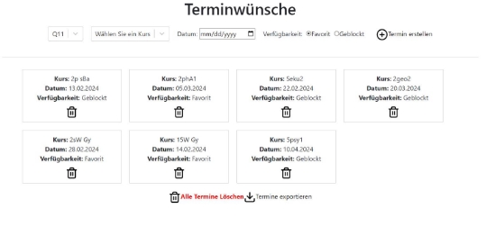

# Exam_Scheduler

Table of contents

[1 User Interface School Task Planner](#_page1_x56.69_y56.69) 2

1. [Structure of the Excel lists when uploading the course list and student list. . . .](#_page2_x56.69_y602.93) . . . . . . 3
1. [The course list ](#_page3_x56.69_y56.69). . . . . . . . . . . . . . . . . . . . . . . . . . . . . . . . . . . . . . . . 4
1. [The calendar list .](#_page3_x56.69_y267.79) . . . . . . . . . . . . . . . . . . . . . . . . . . . . . . . . . . . . . 4
1. [Upload an Excel file. .](#_page3_x56.69_y602.63) . . . . . . . . . . . . . . . . . . . . . . . . . . . . . . . . . . 4
1. [Syntax Checker .](#_page4_x56.69_y378.38) . . . . . . . . . . . . . . . . . . . . . . . . . . . . . . . . . . . . . . . . . . . . 5

   [1.3.1 File headers . ](#_page5_x56.69_y484.85). . . . . . . . . . . . . . . . . . . . . . . . . . . . . . . . . . 6

1. [Configure the algorithm. .](#_page6_x56.69_y56.69) . . . . . . . . . . . . . . . . . . . . . . . . . . . . . . . . 7
1. [The Calendar ](#_page6_x56.69_y552.68). . . . . . . . . . . . . . . . . . . . . . . . . . . . . . . . . . . . . . . . . . . . 7

[2 User Interface Appointment Tool](#_page9_x56.69_y472.45) 10

1

1 User Interface Schoolwork Planner

The School Task Planner user interface, shown in Figure 1, consists of the following elements:

- **Two upload buttons:** These are used to upload the course list and the calendar list.
- **One configuration button:** This button allows the user to configure the algorithm.
- **Four consecutive buttons:** These are used to initialize, start, iterate individually and stop the algorithm.
- **The calendar:** All school tasks as well as vacations and public holidays are displayed here.
- **An Explanation Feature:** This provides a brief explanation to the user on first use.
- **Two download buttons:** With these the user can download the finished school tasks as an Excel file.

Figure 1: User interface when starting the application

Show explanation: This function starts a tour of the window, showing the user an explanation of each individual component in the user interface. During this tour, the individual components are highlighted and a dialog box appears. The user can click through the tour, skip individual steps or navigate through the tour using the arrow keys. During the tour, the user can already interact with the buttons, but scrolling in the window is disabled. If the user wants to scroll again, he or she must end the tour.

Figure 2: Reactour when you press explanation

- **Student List Upload:** The file containing the course list and calendar list to be uploaded should be an Excel file in the appropriate format. After successful uploading, the button turns green and shows the number of courses and students that have been successfully imported.
- **Calendar upload:** When uploading the calendar, the number of events uploaded and the period in which the school tasks take place are displayed.

1. Structure of the Excel lists when uploading the course list and student list

There are two different structures for creating Excel lists. One structure for the **Course list** and another for the **Calendar list**. These look like this:

Figure 3: Left: Example of the course list, Right: Example of the calendar list

1. Thecourse list

A line in the course list should represent a course, where it has **a name**, **a teacher** who teaches the course, **a subject** and then **a track** to which this course is assigned . This is followed by **the student list** which contains all students who are taking part in this course.

- **The rate** is given in column A, with the header on the first line. It is important to note that each course can only appear in the column **once**.
- **The teacher, the subject and the track** are stated in columns B, C and D respectively. Here too, the header begins on the first line. It may well happen that one of these points occurs several times. For example, a teacher can teach multiple courses, multiple courses can be assigned to a track, and multiple courses can share a subject.
- **The student list** starts from column E. Compared to the first four columns, the student list can contain more than just one object. The students of the course are listed one after the other starting from column E in the corresponding row of the course, whereby each cell may only contain one student.

2. Thecalendar list

Compared to the course list, the calendar list has two headers. One header for reading in the period of the school semester and another for reading in the events, i.e. the holidays and public holidays.

**Header 1** (Line 1):

Column A ⇒ school semester (period) Column B ⇒ semester - start

Column C ⇒ Half-year - end

Nothing is stated under the **School semester (period)** column. The line remains empty. This is only intended to illustrate that the coming school semester should then be specified. This is exactly what happens under the **Half-year - start** and **half-year - end** columns. The given time period is then taken into account in the school assignment planner. Exams and other events will only be planned within this period.

**Header 2** (Line 4):

Column A ⇒ Name of the event Column B ⇒ Start

Column C ⇒ End

These columns contain the events line by line. Starting with the **Event Name** column which is accompanied by the **Start** day and the **End** day of the event. If the event only has a start day without an end day (i.e. no entry in this cell), then

This event is treated as a **holiday**. If a start day and an end day are specified,

this is a **holiday**. Anything else is invalid input.

2. Uploadan Excel file

The first step for the school assignment planner will be to upload the course list as well as the calendar list. You have two buttons available for this. These are called **UPLOAD COURSES** and **UPLOAD CALENDAR**.

Figure 4: Course list and calendar list when uploading

Two events can occur during upload:

1. The file has been uploaded successfully. The upload buttons light up green and you are provided with additional information regarding the respective list, see Figure 4.

- Course list: The number of students and courses that were successfully uploaded are stated here.
- Calendar list: The number of events that were successfully uploaded as well as the time span of the school semester are indicated here.

Once this is done, you can continue with the procedure.

2. The file contains an error and the list upload is aborted. The reasons for this can be various. The error is found by the syntax checker when reading the selected Excel file. If the upload is aborted, a message will be displayed, see Figures 5[ and](#_page4_x484.76_y761.91) 6

This can be the following types of warning messages:

- Warning message: The syntax checker detected something suspicious, but this does not necessarily lead to a problem: the program continues to run. A description of the reason for the warning is included, as well as a line specification (if this is necessary). Match it with the Excel file of the list.
- Error message: An error was discovered in your Excel file of the list that the program cannot handle. A description of the error is given with a line number. The list upload will be canceled and you will be asked to correct this error.

Once you have corrected the error in the list, you can attempt to upload again using the same procedure as before.

3. Syntax checker

When creating an Excel list, be it for the course or for the calendar, it is important to adhere to the structure. To ensure that this is adhered to, but above all to avoid a critical error when executing the program, the syntax checker supports you in discovering errors in your Excel list before they are fully uploaded and added to one critical errors in the web application.

The following errors are discovered in the respective lists:

Course list:

- duplicate courses in a column and duplicate students in a row
- incomplete information in the first four columns course/teacher/subject/track (empty cells)
- empty cells between two students in a row

Figure 5: Messages if the price list is incorrect

Calendar list:

- if a public holiday overlaps with another public holiday (the same also applies to holidays)
- if an event does not have a 'start' day
- if an event contains an invalid date (e.g. February 32, 2024)
- if the 'start' day begins after the 'end' day (i.e. a journey into the past)

Figure 6: Messages when the calendar list is incorrect

Errors checked in both lists:

- if the header is incomplete/incorrect
- if you upload an incorrect list

1.3.1 File headers

For the price list, you must note that the header columns are specified as follows:

Column A ⇒ **Course** Column B ⇒ **Teacher** Column C ⇒ **Subject** Column D ⇒ **Track** Column E ⇒ **Student list**

When it comes to the calendar list, you must note that it has two headers. One in row 1 and the other in row 4. Here the columns should look like this:

Column A, line 1 ⇒ **School half-year (period)** Column A, line 4 ⇒ **Name of the event** Column B, line 1 ⇒ **Half-year - start**

Column B, line 4 ⇒ **Start**

Column C, line 1 ⇒ **half year - end**

Column C, line 4 ⇒ **End**

What you also need to make sure is that you upload the correct Excel file. To avoid this error, the name of the Excel price list should contain the word course in some form, which is not case sensitive. For example, the list could be called **Course**list_Q12, but not K-List., the word course is missing. Exactly the same applies to the calendar list with the word 'calendar'.

4. Configurethe algorithm

When you click on the ¨Configure¨ button, the pop-up window shown in Figure 7 opens (#\_page6_x484.76_y500.03). This makes it possible to adjust the parameters to improve the distribution. Appointment specifications from the separate appointment tool can also be uploaded here.

- The iteration number indicates how often the improvement should be carried out. As a rule, a final result is achieved after just 10 to 20 runs.
- The complexity of the exchange determines how many exchange partners should be considered for an exam. It should be noted that with larger numbers the number of swaps to be carried out increases exponentially. For most applications, 2 and 3 should be completely sufficient, although a significantly longer runtime can also be expected with 3. A complexity of 4 ensures that a single iteration of the algorithm takes a very long time, which is why it is recommended to only proceed step by step with ¨next¨.
- When the target rating is reached, the algorithm is terminated early, even if not all intended iterations have been executed yet. However, the best achievable rating depends very much on how many exams have to be distributed and how long the time period is available. Spreading fewer exams over a long period of time allows for greater intervals between individual exams and thus better assessment. It is recommended to set the target rating relatively small and to limit the algorithm better with the maximum number of iterations.
- The minimum difference indicates the difference in rating by which the next iteration must differ from the previous one. If the differences are too small, the algorithm is terminated. Relatively low numbers are recommended here.

Figure 7: Popup window for configuration

5. The Calendar

Initially the calendar is grayed out and cannot be clicked. The user cannot interact with it as long as nothing has been uploaded using the “Upload Calendar” button. As soon as a file has been uploaded, the calendar is activated. The period set in Excel is set in the calendar. This means that if the period is set from October to February, the user can only interact in the calendar during this period. Using the arrow keys the user can move to the next or previous month. The “Today” button allows the user to jump to the current month.

Figure 8: Calendar grayed out

Once the calendar is uploaded, the first vacations and public holidays will appear in the calendar as a blue event.

Figure 9: Calendar after uploading the calendar list

As soon as the user clicks “Initialize”, the first school tasks will appear in the calendar. Depending on the rating of the school tasks, the events are displayed in red, yellow or green. Red means bad, yellow means ok and green means good. The events can also be moved using drag and drop. If the user wants to move the events themselves, they can do so at will. The change is saved automatically.

Figure 10: Calendar after initialization

If the user places an event on a date that is blocked by a constraint, a pop-up window appears with an error message indicating that the event cannot be placed on that date.

Figure 11: Constraint

Delete Event: When the user clicks on an event, a dialog box opens asking if they want to delete the event. If the user clicks “Cancel,” nothing happens. However, if he clicks “Delete,” the event will be deleted.

Figure 12: Delete an event

- **Download Student:** This button allows downloading the student list after applying the algorithm. The downloaded list provides information about which students have which schoolwork.
- **Download dates:** This button allows you to download the dates of individual school tasks. The downloaded list contains the dates for each school assignment.

Figure 13: Downloading the lists as an Excel file

2 user interface appointment tool

Initially, no restrictions are displayed. The Select Course input form contains no content because the user must first select a quarter. Next, the user must select a date. If the user tries to create a constraint without selecting a date or selecting an invalid date (i.e. a past date, a weekend, or a holiday), the interface displays an appropriate error.

Figure 14: Appointment tool restarting

Figure 15: Appointment tool with incorrect date entry

If the date is chosen correctly, clicking “Create Appointment” will create a new restriction that will then be displayed. Each restriction has its own Delete button. Alternatively, the list of restrictions can be cleared by clicking the “Delete all appointments” button. To persist the restriction list between backend server restarts, the user needs to start the default SQL server (with username: root and password: root) on their computer.

Figure 16: Appointment tool with restrictions

Finally, the list can be exported by pressing the “Export Appointments” button. The file is then downloaded by the browser and can be uploaded to the calendar application.

Figure 17: Exported appointment file in the browser
